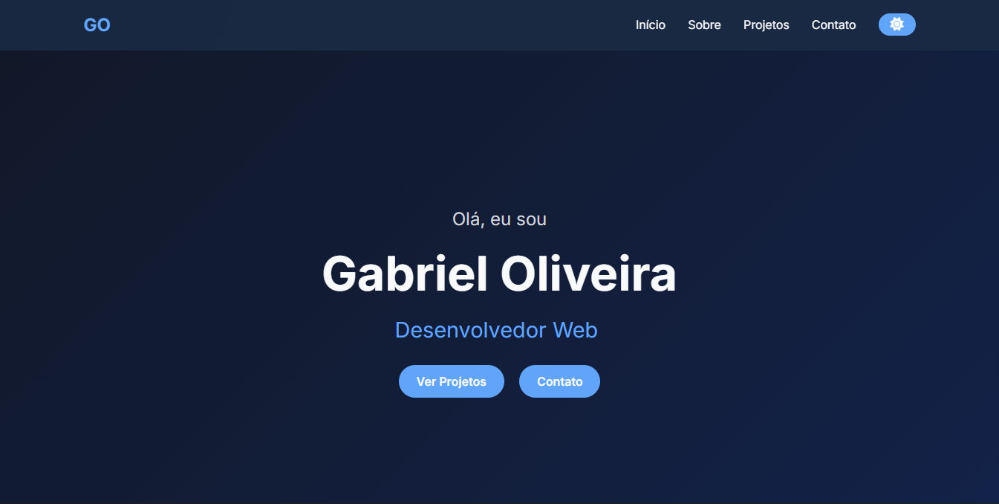

# 🌐 Portfólio - Gabriel Oliveira

Bem-vindo ao meu portfólio!  
Este projeto foi desenvolvido para apresentar meus principais trabalhos e demonstrar minhas habilidades em **Desenvolvimento Web Front-End**, com foco em **usabilidade, performance e design responsivo**.

---

## 🚀 Tecnologias Utilizadas

- **HTML5** – Estrutura semântica e organizada  
- **CSS3** – Estilização moderna com foco em responsividade  
- **JavaScript (ES6+)** – Interatividade e funcionalidades dinâmicas  
- **Git & GitHub** – Versionamento e colaboração  
- **Netlify** – Hospedagem e deploy contínuo  

---

## 💼 Acesse Meu Portfólio

👉 **[Clique aqui para visitar o site](https://gabrieldevv.netlify.app/)**  

---

